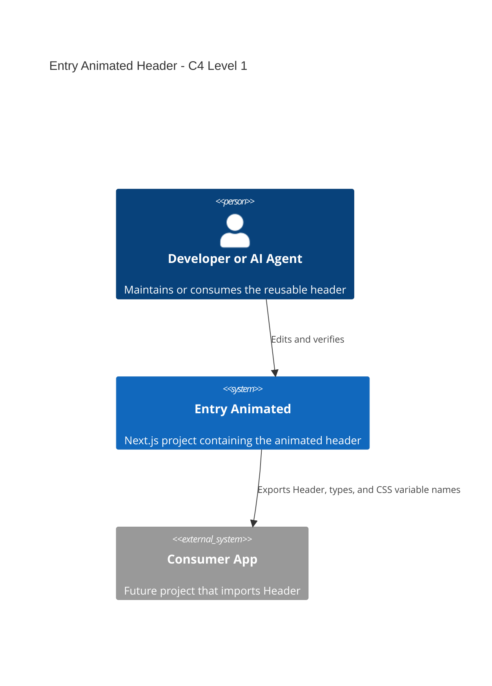

# AGENTS.md

## Project Overview

Entry Animated is a small Next.js project whose main purpose is to provide a reusable animated header component. The header starts as a full-viewport intro with background imagery and a centered brand, then collapses into a fixed top navigation bar.

The repository should be treated as component-first code. Changes MUST preserve the header contract, animation behavior, accessibility, and portability unless the user explicitly asks for a product redesign.

## Tech Stack

- Next.js `15.x` with App Router.
- React `19.x`.
- TypeScript `5.8.x` with strict mode.
- CSS Modules and CSS custom properties for styling.
- Vitest + Testing Library for behavior tests.
- ESLint + Prettier for code quality and formatting.
- Package manager: `pnpm@11.4.0`.

## Project Structure

```text
src/
├── app/                         Next.js app shell and demo page.
├── components/
│   ├── features/
│   │   └── header/              Reusable animated header feature.
│   └── index.ts                 Component-layer public exports.
├── hooks/                       Shared React hooks.
├── lib/                         Shared utilities.
└── index.ts                     Root public entry point for consumers.

docs/
├── README.md                    Documentation map.
├── architecture.md              System and module architecture.
├── development.md               Local development and quality workflow.
├── header-reference.md          Header props, tokens, and usage.
├── known-issues.md              Current limitations and cautions.
└── adr/                         Architecture decision records.
```

## Key Conventions

- Public consumers SHOULD import from `src/index.ts` or `@/index`.
- `Header` is the public component. Files inside `src/components/features/header/components` are internal implementation details.
- Use named exports only. Avoid default exports outside Next.js route files.
- Keep feature-specific constants, hooks, types, styles, and tokens inside `src/components/features/header`.
- Header-specific styling MUST use header CSS variables from `tokens/header.tokens.module.css`.
- Do not reintroduce `!important`, `float`, or `href="#"` defaults in the header.
- Do not change the animation by switching layout models during transition. The brand anchor MUST remain `position: absolute` in both intro and collapsed states.
- Tests should assert behavior and public contract, not implementation-only CSS module class names.

## Architecture Overview



If Mermaid C4 syntax is unsupported, interpret the diagram as: developers maintain this repo, this repo exposes a reusable header contract, and future applications consume that contract.

## Important Files

- `src/index.ts`: root public API.
- `src/components/features/header/components/Header.tsx`: header composition and prop defaults.
- `src/components/features/header/types/header.types.ts`: public prop and nav item contracts.
- `src/components/features/header/tokens/header.tokens.module.css`: CSS variable definitions.
- `src/components/features/header/styles/header.module.css`: animation and responsive layout.
- `src/components/features/header/components/Header.test.tsx`: behavior characterization tests.
- `src/index.test.ts`: public API smoke test.

## Known Issues

See [docs/known-issues.md](./docs/known-issues.md).

## Quality Commands

Run these before handing work back:

```sh
pnpm format:check
pnpm lint
pnpm typecheck
pnpm test
pnpm build
```

If a local dev server is running and `pnpm build` fails because `.next` is being used concurrently, stop the dev server, clean the generated `.next` artifact if needed, and rerun the build.

## Further Reading

- [Documentation index](./docs/README.md)
- [Architecture overview](./docs/architecture.md)
- [Header reference](./docs/header-reference.md)
- [Development workflow](./docs/development.md)
- [ADR 0001: Header as reusable feature](./docs/adr/0001-header-as-reusable-feature.md)
